<picture>
  <source media="(prefers-color-scheme: dark)" srcset="assets/header-en-dark.svg">
  
</picture>

**Data scientist and AI engineer. Available for a permanent role from September 2026, in Paris or remote.**

I'm looking for a team that puts models into production, not only dashboards. Write to me and
I'll answer within 24 hours.

[CV in PDF](https://github.com/maxime2476/cv/releases/latest/download/CV_Maxime_Gourguechon.pdf) · [LinkedIn](https://www.linkedin.com/in/maximegourguechon/) · [maximeg2408@gmail.com](mailto:maximeg2408@gmail.com) · [Version française](README.md)

Hi, I'm Maxime. I'm finishing a master's in econometrics in Lille and I'm a final-year intern at
Aubay, working in computer vision. I came from economics rather than computer science, which is
where I learned to distrust correlations and to check that a result holds up before believing it.
The engineering side I learned on my own projects, and they are all here.

## What I'm working on

At Aubay I segment images of coral reefs: a first model finds the corals, a second traces their
outline pixel by pixel, across 8,000 images. Making it work on clean photographs was not the hard
part. The real problem came from actual dive footage, which is blurry and stripped of red by the
water. So I manufactured those defects during training, to let the model meet them before
suffering them: 92 % precision. I also automated dataset preparation, which saves six hours per
training cycle and therefore doubles the number of experiments I can run in a week.

## The project that represents me best

### [causal-impact-lab](https://github.com/maxime2476/causal-impact-lab) · does raising interest rates actually destroy jobs?

I wrote down the question, and what would make me answer no, before running a single estimation.
Then I measured it on US employment, state by state and sector by sector, from 1994 to 2020. The
effect carries the expected sign everywhere, but it stays too imprecise to claim that it exists.
I could have buried that result and shown something else; instead it is on the front page of the
repository, with the reason why.

<picture>
  <source media="(prefers-color-scheme: dark)" srcset="assets/irf-en-dark.svg">
  
</picture>

How to read it: the orange line is the estimated effect, month after month, and the pale band
around it is the margin of error. As long as that band contains zero, the effect cannot be
claimed to exist. That is the case here, and that is the conclusion.

## The others

- **[git-survival](https://github.com/maxime2476/git-survival)**: when does a developer stop contributing to a project? I apply the survival methods used in medicine to Git histories, because someone who has been quiet for three weeks has not necessarily left.
- **[bmw-sales-analytics](https://github.com/maxime2476/bmw-sales-analytics)**: 50,000 car sales, a spotless dataset, and nothing to predict. I proved the absence of signal instead of forcing a model, then shipped a [scenario simulator](https://maxime2476-bmw-sales-analytics.hf.space) you can try
online instead.
- **[heron](https://github.com/maxime2476/heron)**: a webcam posture monitor that runs entirely on your machine. Written because I spent my days slouching at my desk.
- And [sentiment-powell-nlp](https://github.com/maxime2476/sentiment-powell-nlp), my first real NLP project, on the tone of Federal Reserve press conferences.

## Check for yourself

- **In 3 minutes**, both applications run online: [the BMW simulator](https://maxime2476-bmw-sales-analytics.hf.space) and [causal-impact-lab](https://huggingface.co/spaces/maxime2476/causal-impact-lab).
- **In 20 minutes**, [the results of causal-impact-lab](https://github.com/maxime2476/causal-impact-lab/blob/main/docs/results.md) state the verdict and its limits, in that order.
- **In 1 hour**, clone the repository and run `uv sync --all-extras` then `uv run pytest`, the same checks that run on every change.

## Three notes

The three write-ups below are in French: [survival censoring](notes/01-censure-et-abandon.md),
[proving the absence of signal](notes/02-un-dataset-propre-et-vide.md), and
[domain shift underwater](notes/03-segmenter-sous-l-eau.md). Happy to walk through any of them in
English.

## What I can do

Shipped and running, meaning deployed publicly or used in the internship pipeline: Python,
PyTorch, scikit-learn, YOLO, SAM 3, OpenCV, MediaPipe, XGBoost, SHAP, lifelines, statsmodels,
Streamlit, Docker, GitHub Actions.

Used seriously in a project or a thesis, never put into service: R, MLflow, double machine
learning, Bayesian local projections, non-Gaussian bootstrap, DEA and Simar-Wilson regression.

Read about, not yet shipped: managed AWS deployment, production model monitoring, LLM agents in
production. I'm working on it, starting with the AWS Machine Learning Engineer certification.

A master's in finance at IAE Saint-Étienne before Lille, an economics degree in Rouen,
DataCamp and Voltaire certifications, English at B2: the detail is in the CV, which is recompiled
from <a href="https://github.com/maxime2476/cv">its LaTeX source</a> on every change. The figures
on this page are drawn from the actual results in the repositories and regenerate with
<code>python tools/render_assets.py</code>.
