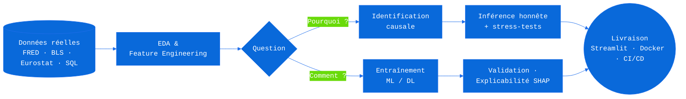
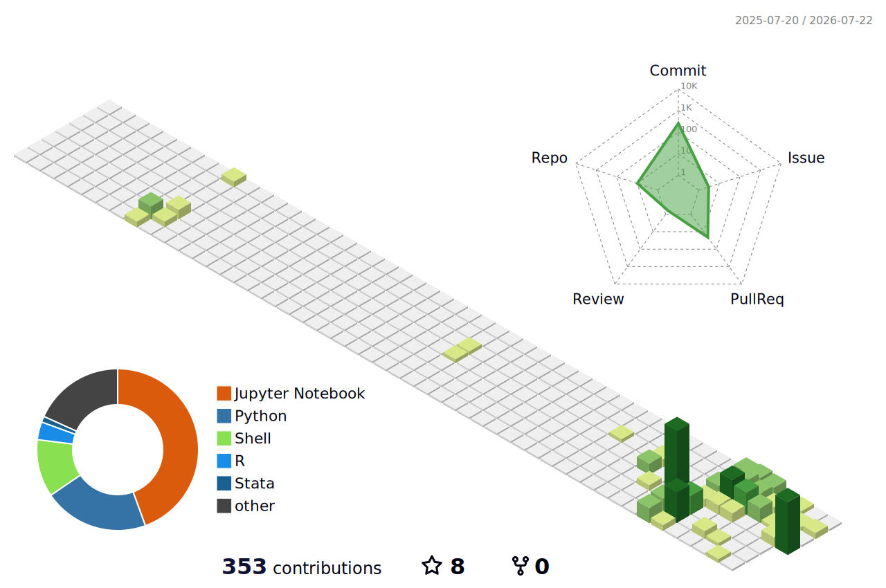

<div align="center">

  

  <a href="https://github.com/maxime2476">
    
  </a>

  <br/><br/>

  <a href="https://www.linkedin.com/in/maxime-gourguechon76/"></a>
  <a href="mailto:maxime.gourguechon76@gmail.com"></a>
  <a href="https://huggingface.co/maxime2476"></a>

</div>

<br/>

## Qui je suis



Je suis data scientist chez Aubay et diplômé d'un MSc en économétrie et statistiques. Ce qui m'intéresse, c'est de comprendre pourquoi un résultat est vrai (dérivation, identification, simulation Monte Carlo), puis de le livrer sous une forme qui fonctionne vraiment : des tests, de la CI, du Docker, une démo en ligne. J'aime aussi le travail plus ordinaire (requêtes SQL, scoring, monitoring, rapports) et j'essaie de le faire avec le même sérieux.

Sur ce profil, j'ai préféré indiquer des niveaux honnêtes plutôt que d'écrire « expert » partout, et j'ai ajouté une section sur ce que je ne sais pas encore faire.

<br clear="both"/>

<div align="center"></div>

## La méthode

<table>
  <tr>
    <td width="50%" valign="top">
      <h3 align="center">Le Pourquoi, l'économétrie</h3>
      <p align="center"><em>Isoler la causalité de la simple corrélation</em></p>
      <ul>
        <li>Identification causale : effets fixes, hétérogénéité transversale, chocs identifiés, <em>impulse responses</em></li>
        <li>Économétrie de panel, séries temporelles (ARIMA, GARCH), microéconométrie (scoring logistique)</li>
        <li>Hypothèses explicites, stress-tests d'identification, corrections de comparaisons multiples</li>
      </ul>
    </td>
    <td width="50%" valign="top">
      <h3 align="center">Le Comment, le machine learning</h3>
      <p align="center"><em>Prédire juste, expliquer pourquoi, livrer en production</em></p>
      <ul>
        <li>Gradient boosting, deep learning tabulaire, NLP (fine-tuning BERT, embeddings + BiLSTM/CNN)</li>
        <li>IA générative : RAG, agents, LangChain/LangGraph, avec un harnais d'évaluation pour chaque système</li>
        <li>Explicabilité SHAP, décision sous incertitude, Streamlit, Docker, CI/CD</li>
      </ul>
    </td>
  </tr>
</table>

<div align="center">



</div>

<div align="center"></div>

## Les trois projets qui me résument

**[causal-impact-lab](https://github.com/maxime2476/causal-impact-lab)**, le projet le plus proche de ce que j'aime faire. J'y estime l'effet causal des chocs de politique monétaire américaine sur l'emploi, avec des chocs identifiés (Bu-Rogers-Wu), le taux fantôme Wu-Xia et des données FRED et BLS. Les deux estimands sont hiérarchisés selon la solidité de leur identification, et les résultats nuls sont rapportés aussi visiblement que les positifs. Côté code : mypy en mode strict, des tests par propriétés, des décisions d'architecture documentées, et une [application en ligne](https://huggingface.co/spaces/maxime2476/causal-impact-lab).

**[ml-from-scratch-R](https://github.com/maxime2476/ml-from-scratch-R)**, mon projet de fin d'études. Je réimplémente chaque modèle de machine learning en R base à partir de sa dérivation mathématique complète, je le valide contre le package de référence (tolérance de 1e-8, ou une justification écrite quand elle n'est pas atteignable), puis je le passe au Monte Carlo : au moins 1000 réplications, avec le biais, la variance et la couverture des intervalles de confiance. Le but n'est pas la performance, mais de montrer que je comprends ce qu'il y a derrière `model.fit()`.

**[bmw-sales-analytics](https://github.com/maxime2476/bmw-sales-analytics)**, le projet le plus proche de la production. 50 000 transactions sur quinze ans, de l'économétrie et du gradient boosting côte à côte, un enrichissement par de vraies API externes, SHAP, et un simulateur de scénarios avec intervalles crédibles. Le tout est livré proprement : Docker multi-stage, couverture Codecov, [dashboard en ligne](https://maxime2476-bmw-sales-analytics.hf.space) et [documentation](https://maxime2476.github.io/bmw-sales-analytics/).

<div align="center">

  <a href="https://github.com/maxime2476/causal-impact-lab">
    <picture>
      <source media="(prefers-color-scheme: dark)" srcset="https://github-readme-stats.vercel.app/api/pin/?username=maxime2476&repo=causal-impact-lab&theme=github_dark&title_color=58A6FF&hide_border=true" />
      
    </picture>
  </a>
  <a href="https://github.com/maxime2476/bmw-sales-analytics">
    <picture>
      <source media="(prefers-color-scheme: dark)" srcset="https://github-readme-stats.vercel.app/api/pin/?username=maxime2476&repo=bmw-sales-analytics&theme=github_dark&title_color=58A6FF&hide_border=true" />
      
    </picture>
  </a>

  <a href="https://github.com/maxime2476/ml-from-scratch-R">
    <picture>
      <source media="(prefers-color-scheme: dark)" srcset="https://github-readme-stats.vercel.app/api/pin/?username=maxime2476&repo=ml-from-scratch-R&theme=github_dark&title_color=58A6FF&hide_border=true" />
      
    </picture>
  </a>
  <a href="https://github.com/maxime2476/sentiment-powell-nlp">
    <picture>
      <source media="(prefers-color-scheme: dark)" srcset="https://github-readme-stats.vercel.app/api/pin/?username=maxime2476&repo=sentiment-powell-nlp&theme=github_dark&title_color=58A6FF&hide_border=true" />
      
    </picture>
  </a>

</div>

Pour le reste : [sentiment-powell-nlp](https://github.com/maxime2476/sentiment-powell-nlp), du NLP sur les conférences du FOMC, où les clusters *dovish* précèdent les baisses de taux de deux à trois sessions (p < 0.01, Wilcoxon avec correction de Bonferroni) ; [panel-project](https://github.com/maxime2476/panel-project), un panel européen sur données Eurostat, notamment l'impact du Covid sur le PIB par habitant ; [mastercard-data](https://github.com/maxime2476/mastercard-data), un scoring bancaire par régression logistique ; [academic-stress](https://github.com/maxime2476/academic-stress), une analyse d'enquête auprès de 140 étudiants ; et [linux-sys-monitor](https://github.com/maxime2476/linux-sys-monitor), un démon de monitoring écrit en Bash, avec des alertes Discord et Slack.

<div align="center"></div>

## GenAI Lab, la roadmap publique

Mon prochain chantier, c'est l'IA générative, que je veux aborder comme le reste : je ne livrerai pas un système que je ne sais pas évaluer. Beaucoup de démos RAG n'ont aucun harnais d'évaluation, et c'est justement sur ce point que je veux travailler.

| Projet | Objectif | Stack visée | Statut |
| :--- | :--- | :--- | :---: |
| **rag-eval-lab** | Un pipeline RAG sur corpus économique (rapports FOMC, Eurostat) avec un harnais d'évaluation complet : Recall@k, MRR, nDCG, <em>faithfulness</em>, taux d'hallucination, <em>LLM-as-judge</em> validé contre une annotation humaine | LangChain · base vectorielle · RAGAS |  |
| **agent-econ-analyst** | Un agent d'analyse économétrique : orchestration multi-outils (SQL, statsmodels, recherche documentaire), traçabilité complète des décisions, garde-fous testés | LangGraph · function calling · pytest |  |
| **llm-fine-tuning** | Le prolongement de `sentiment-powell-nlp` : passer du fine-tuning BERT aux LLMs (LoRA/QLoRA), en comparant honnêtement avec le <em>prompting</em> et le RAG à coût égal | PyTorch · PEFT · HF |  |

Les statuts seront mis à jour au fil des livraisons, métriques comprises, même si elles sont décevantes.

<div align="center"></div>

## Ce que je sais faire, et à quel point

<div align="center">
  <a href="https://skillicons.dev">
    
  </a>
  <br/><br/>
  
  
  
  
  
  
  
</div>

<br/>

| | |
| :--- | :--- |
| Économétrie (panel, séries temporelles, inférence causale) | `██████████` c'est mon métier |
| R (R base, testthat, Quarto) et Python (pandas, NumPy, scikit-learn) | `██████████` au quotidien |
| Qualité logicielle (ruff, mypy strict, pytest, pre-commit) et Docker/CI | `████████░░` solide, en progression |
| SQL (PostgreSQL, DuckDB) | `████████░░` solide |
| Deep learning (PyTorch, TensorFlow) | `██████░░░░` fonctionnel, pas expert |
| GenAI (LangChain, RAG, agents, évaluation LLM) | `███░░░░░░░` j'apprends, premier projet en cours |

### Ce que je ne sais pas (encore) faire

Kubernetes et l'orchestration à grande échelle. Le deep learning au niveau recherche (je lis les papiers, je ne les écris pas). Le front-end au-delà de Streamlit. Et en GenAI, je débute : je préfère ne pas afficher LangChain comme une compétence maîtrisée tant que `rag-eval-lab` n'est pas public avec ses métriques.

<div align="center"></div>

## Standards

Ce que j'essaie de mettre dans chacun de mes projets sérieux, et qui se vérifie dans les dépôts : un typage strict, des tests à plusieurs niveaux (unitaires, par propriétés, golden, DGP synthétiques), du lint et des hooks pre-commit, une CI sur chaque push avec la couverture mesurée, des environnements verrouillés, des décisions d'architecture documentées, et une livraison qui va jusqu'à la démo en ligne.

<div align="center"></div>

## Télémétrie

Mon temps de code réel de la semaine (WakaTime, mis à jour chaque nuit) :

<!--START_SECTION:waka-->

```txt
No activity tracked
```

<!--END_SECTION:waka-->

<div align="center">

  <picture>
    <source media="(prefers-color-scheme: dark)" srcset="https://github-readme-stats.vercel.app/api?username=maxime2476&show_icons=true&theme=github_dark&title_color=58A6FF&icon_color=58A6FF&hide_border=true&count_private=true&locale=fr" />
    
  </picture>
  <picture>
    <source media="(prefers-color-scheme: dark)" srcset="https://github-readme-stats.vercel.app/api/top-langs/?username=maxime2476&layout=compact&theme=github_dark&title_color=58A6FF&hide_border=true&locale=fr" />
    
  </picture>

  <br/><br/>

  <picture>
    <source media="(prefers-color-scheme: dark)" srcset="https://github-readme-activity-graph.vercel.app/graph?username=maxime2476&bg_color=transparent&color=9198a1&line=58A6FF&point=58A6FF&area=true&area_color=1F6FEB&hide_border=true" />
    
  </picture>

  <picture>
    <source media="(prefers-color-scheme: dark)" srcset="https://raw.githubusercontent.com/maxime2476/maxime2476/output/github-snake-dark.svg" />
    
  </picture>

  <picture>
    <source media="(prefers-color-scheme: dark)" srcset="./profile-3d-contrib/profile-night-green.svg" />
    
  </picture>

</div>

## En ce moment

Je finalise `ml-from-scratch-R` module par module, je monte `rag-eval-lab`, et j'approfondis les stress-tests d'identification de `causal-impact-lab`. Je suis ouvert à toute proposition (embauche, mission ou collaboration), du besoin analytics du quotidien au projet de recherche.

<div align="center"></div>

Si quelque chose ici vous parle (un projet, une remarque, une proposition, ou même une objection sur un choix de méthode), écrivez-moi : [maxime.gourguechon76@gmail.com](mailto:maxime.gourguechon76@gmail.com). Sinon, je suis sur [LinkedIn](https://www.linkedin.com/in/maxime-gourguechon76/) et mes démos tournent sur [Hugging Face](https://huggingface.co/maxime2476).

<sub>Dernière mise à jour : juillet 2026. Ce profil évolue avec mes dépôts.</sub>

<div align="center">

  <br/>

  **Mes dépôts épinglés sont juste en dessous, c'est là que tout se vérifie.**

  

</div>
