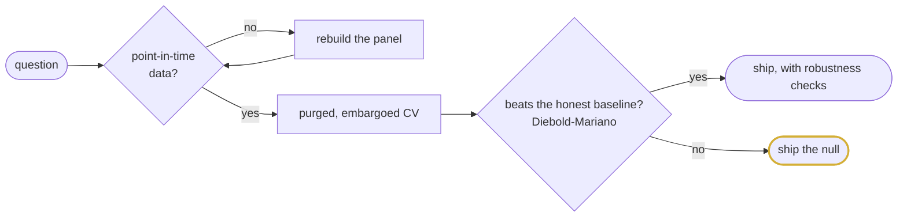

  
  
  
  

I came to machine learning from econometrics (MSc in Econometrics & Statistics, Université de Lille), and it shows. Modern ML produces excellent point predictions and, if you are not careful, invalid inference. So I spend most of my time on the unglamorous parts that decide whether a result is real: point-in-time data, temporal leakage, robustness checks that are allowed to fail.

Currently an AI research engineer intern at **Aubay**, building a coral instance segmentation pipeline (YOLO + SAM) with the **CNRS Fondation Science4Reefs**.

## The regression behind the banner

$$
\Delta_h \ln E_{s,t+h} \;=\; \beta_h\,\big(\mathrm{Exposure}_s \times \varepsilon^{\,MP}_{t}\big) \;+\; \alpha_s \;+\; \lambda_t \;+\; \Gamma' X_{s,t} \;+\; u_{s,t+h}
$$

State-level rate exposure interacted with an identified monetary shock, time fixed effects absorbing the aggregate. Across local projections, LP-DiD, double ML and a Bayesian variant, the $\beta_h$ came back null on 2014-2020. [causal-impact-lab](https://github.com/maxime2476/causal-impact-lab) is the paper trail.

## Selected work

### [causal-impact-lab](https://github.com/maxime2476/causal-impact-lab) · do monetary shocks destroy jobs?

End-to-end causal study on real point-in-time data (ALFRED vintages, BLS QCEW, Bu-Rogers-Wu shocks). The analysis plan was frozen before estimation, every identifying assumption is registered and linked to the probe that stress-tests it, and **the headline effect shipped as a null.** Typed end to end (`mypy --strict` in CI), pandera contracts at every dataset boundary, 80 tests, nine architecture decision records.

### [bmw-sales-analytics](https://github.com/maxime2476/bmw-sales-analytics) · what to do when the data has no signal

Decision-support platform on 15 years of car sales data. Two results, both on purpose. On signal-bearing data the pipeline reaches a cross-validated R² around 0.85, with SHAP recovering the true drivers. On the actual dataset, which turns out to be structurally clean but statistically empty (plus one leaked target), the same pipeline scores an honest R² near zero, established with permutation tests and a positive control. Value is then delivered where it legitimately can be: a scenario simulator with explicit uncertainty.

### [linux-sys-monitor](https://github.com/maxime2476/linux-sys-monitor) · small tool, kept honest

Lightweight Bash monitoring daemon for Linux servers. Alerts to Slack or Discord, systemd unit, Docker image, Grafana dashboard included. Written because I wanted to know exactly what runs on my own machines.

## Three registers, one method

  
  
  

The method itself, compressed:

Yes, the null gets the gold outline. That is the point.

## Open source

Fixes and improvements to tools I use daily:

<!-- TODO: remplacer par les URLs réelles des PRs avant de pousser -->
- **statsmodels**: [merged PR](#) <!-- lien PR statsmodels -->
- **ultralytics**: [open PR](#) <!-- lien PR ultralytics -->

## How I work

Every serious repo here ships with the same defaults, not because a checklist says so but because I have been burned without them: locked environments (`uv`), `ruff` and `mypy --strict` in CI, `pytest` with coverage on Codecov, pre-commit hooks, and decision records for anything I would otherwise re-litigate six months later.

**Stack.** Python (pandas, scikit-learn, statsmodels, PyTorch, pydantic, pandera) · SQL (DuckDB, PostgreSQL) · R and Stata for econometrics · Docker · GitHub Actions · Streamlit

## Now

- Interning at Aubay × CNRS Fondation Science4Reefs, computer vision for reef monitoring
- Building `pitfall`, a point-in-time leakage detection toolkit for time-series ML (release soon)
- Open to full-time roles from **September 2026**: ML engineering, quantitative research, applied science. Paris or remote.

Earlier academic work (FOMC text mining, panel econometrics on Eurostat data) stays public in [sentiment-powell-nlp](https://github.com/maxime2476/sentiment-powell-nlp) and [panel-project](https://github.com/maxime2476/panel-project). That is where the econometrics habit comes from.

---

<em>A model that scores well on a leaky split is worse than no model. Most of what I build exists to make that distinction visible.</em>
