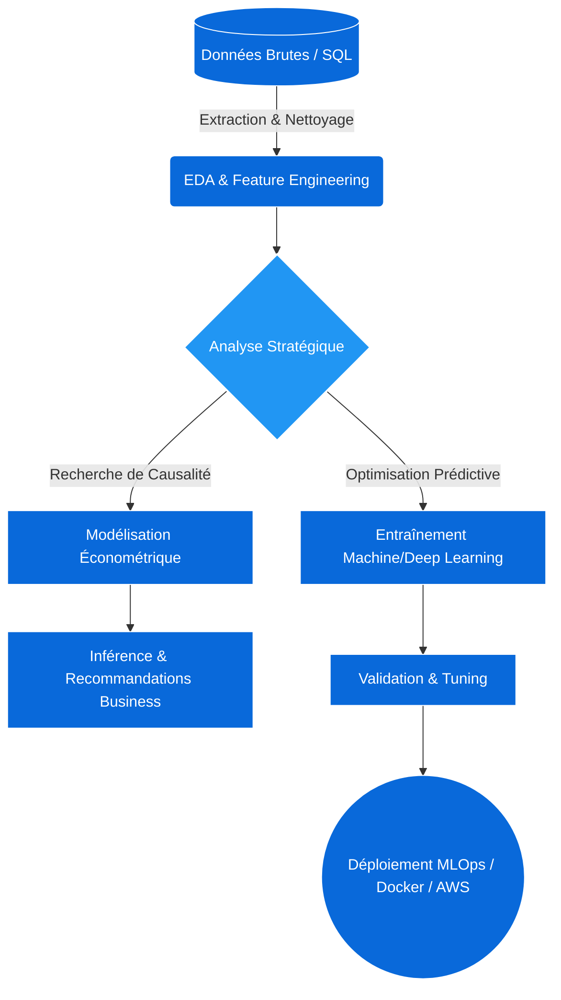

<!-- HEADER ANIMÉ : Capsule Render + Flux de données minimaliste -->

  

  

> **Statut système :** `En ligne` | **Télémétrie :** `Active` | **Objectif :** `Isoler la causalité, optimiser la prédiction`

---

## 💻 Console Interactive : Exécutez vos requêtes

*L'exploration de données commence ici. Cliquez pour interroger les tables.*

<code>> SELECT * FROM philosophie_de_travail WHERE role IN ('Economètre', 'Ingénieur IA');</code>

 
<blockquote>
La donnée ne ment pas, mais elle ne dit pas toujours la vérité d'elle-même. Mon approche est hybride :  
<b>1. L'approche IA (Le "Comment") :</b> Maximiser la précision prédictive grâce au Deep Learning et aux modèles ensemblistes. 
<b>2. L'approche Économétrique (Le "Pourquoi") :</b> Isoler la causalité de la simple corrélation pour garantir que les décisions business sont fondées sur la réalité, et non sur des biais d'échantillonnage.  
<i>Résultat : Des modèles performants ET interprétables, robustes en production.</i>
</blockquote>

<code>> EXECUTE afficher_projets_phares();</code>

 
<table>
  <tr>
    <th width="50%">🔬 Projet : Inférence Causale & Pricing</th>
    <th width="50%">🤖 Projet : NLP & Analyse Financière</th>
  </tr>
  <tr>
    <td>
      <i>Problème :</i> Une baisse de prix augmente-t-elle les ventes, ou est-ce un biais saisonnier ? 
      <i>Méthode :</i> Différences-en-différences, Modèles structurels. 
      <i>Stack :</i> R, Python (DoWhy, CausalImpact). 
       
      <a href="[Lien_Repo_1]"><b>[ > Consulter le code source ]</b></a>
    </td>
    <td>
      <i>Problème :</i> Prédire la volatilité à partir de rapports textuels annuels. 
      <i>Méthode :</i> Fine-tuning de LLMs (RoBERTa), Time Series Forecasting. 
      <i>Stack :</i> PyTorch, HuggingFace, AWS. 
       
      <a href="[Lien_Repo_2]"><b>[ > Consulter le code source ]</b></a>
    </td>
  </tr>
</table>

---

## 🧠 Architecture de mon Workflow (Extraction -> MLOps)

*La théorie ne suffit pas. Voici comment je structure un pipeline de résolution de problème complet.*

---

## 📡 Établir une connexion

  <code><a href="mailto:maxime.gourguechon76@gmail.com">PING [Ton_Email]</a></code> | 
  <code><a href="https://www.linkedin.com/in/maximegourguechon/">CONNECT LinkedIn_Profile</a></code>

