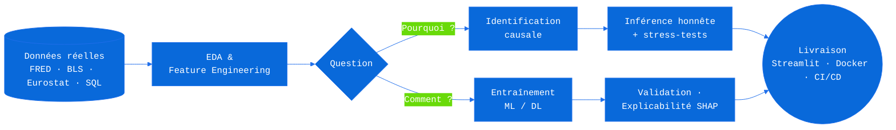

<div align="center">

  <!-- SIGNATURE : bannière animée sur mesure (régression OLS qui se trace en direct, dark/light natif) -->
  

  <!-- Tagline animée -->
  <a href="https://github.com/maxime2476">
    
  </a>

  <br/><br/>

  <a href="https://www.linkedin.com/in/maxime-gourguechon76/"></a>
  <a href="mailto:maxime.gourguechon76@gmail.com"></a>
  <a href="https://huggingface.co/maxime2476"></a>
  

</div>

<br/>

## 🧭 À propos

Data Scientist chez **Aubay** (Boulogne-Billancourt) — **MSc Économétrie & Statistiques**. Polyvalent par choix : aussi à l'aise sur un besoin analytics concret (nettoyage de données, scoring, dashboard, reporting) que sur un projet de **recherche appliquée**, mon appétence particulière. Dans les deux cas, la même conviction : un résultat qu'on ne peut ni reproduire ni vérifier n'est pas un résultat — c'est une anecdote.

- 🔬 **Recherche** — inférence causale sur données macroéconomiques réelles, résultats nuls rapportés aussi visiblement que les positifs
- 📐 **Fondements** — réimplémentation des modèles de ML depuis leur dérivation mathématique, validation numérique et Monte Carlo
- 🚀 **Production** — pipelines complets jusqu'au déploiement : CI/CD, tests, typage strict, Docker, démos live
- 🧰 **Terrain** — et le travail moins glamour fait avec le même soin : requêtes SQL, scoring, monitoring, rapports — voir `mastercard-data` ou `linux-sys-monitor`
- 🤖 **IA générative** — cap actuel : systèmes RAG, agents (LangChain / LangGraph) et LLMs appliqués — avec l'obsession de l'évaluation (métriques de <em>retrieval</em>, taux d'hallucination, <em>LLM-as-judge</em> validé humainement), pas seulement de la démo

---

## 🧠 La Méthode — deux cerveaux, un pipeline

> La donnée ne ment pas, mais elle ne dit pas la vérité d'elle-même.

<table>
  <tr>
    <td width="50%" valign="top">
      <h3 align="center">🔍 Le Pourquoi — Économétrie</h3>
      <p align="center"><em>Isoler la causalité de la simple corrélation</em></p>
      <ul>
        <li>Identification causale : effets fixes, hétérogénéité transversale, chocs identifiés (Bu-Rogers-Wu), <em>impulse responses</em></li>
        <li>Économétrie de panel, séries temporelles (ARIMA, GARCH), microéconométrie (scoring logistique)</li>
        <li>Inférence rigoureuse : hypothèses explicites, <em>stress-tests</em> d'identification, corrections de comparaisons multiples</li>
      </ul>
    </td>
    <td width="50%" valign="top">
      <h3 align="center">⚡ Le Comment — Machine Learning</h3>
      <p align="center"><em>Prédire juste, expliquer pourquoi, livrer en production</em></p>
      <ul>
        <li>Gradient boosting, deep learning tabulaire, NLP (fine-tuning BERT, embeddings + BiLSTM/CNN)</li>
        <li>IA générative : RAG, agents, orchestration LangChain/LangGraph — chaque système livré avec son harnais d'évaluation</li>
        <li>Explicabilité systématique : SHAP, décision sous incertitude, intervalles crédibles</li>
        <li>Livraison : Streamlit, Docker multi-stage, CI/CD, Hugging Face Spaces — un modèle qui ne tourne pas n'existe pas</li>
      </ul>
    </td>
  </tr>
</table>

<div align="center">



</div>

---

## 🏛️ Trois piliers, trois projets phares

*Chaque pilier de ma pratique est incarné par un projet complet et vérifiable.*

### 📐 Pilier 1 — Les fondements · [`ml-from-scratch-R`](https://github.com/maxime2476/ml-from-scratch-R)

> Déconstruction mathématique et statistique des modèles de machine learning — projet de fin d'études.

Chaque modèle est réimplémenté en **R base** à partir de sa **dérivation mathématique complète** (vraisemblance, moindres carrés, conditions d'optimalité), puis soumis à quatre livrables dans un ordre imposé :

| Livrable | Contenu |
| :--- | :--- |
| **(a) Dérivation** | Quarto : hypothèses numérotées, dérivation pas à pas, encadré « de la math au code » |
| **(b) Implémentation** | R base uniquement — les packages (`glmnet`, `rpart`, …) ne servent qu'à la validation |
| **(c) Tests** | `testthat` : conformité aux packages de référence, tolérance cible `1e-8` |
| **(d) Monte Carlo** | DGP explicite, ≥ 1000 réplications : biais, variance, couverture des IC, puissance |

**Ce que ça démontre :** je ne me contente pas d'appeler `model.fit()` — je sais dériver, implémenter et valider ce qu'il y a dedans.

### 🔬 Pilier 2 — La recherche · [`causal-impact-lab`](https://github.com/maxime2476/causal-impact-lab)

> Effet causal des chocs de politique monétaire restrictive américaine sur l'emploi aux États-Unis.

- **Deux estimands hiérarchisés** : effet relatif proprement identifié (hétérogénéité transversale, effets fixes temporels) en tête ; effet dynamique agrégé rapporté séparément, hypothèses d'identification énoncées et *stress-testées*
- **Données réelles exclusivement** : FRED/ALFRED, BLS (QCEW, CES-SAE), taux fantôme Wu-Xia, série de chocs Bu-Rogers-Wu — le synthétique est réservé aux tests
- **Honnêteté scientifique affichée** : « les résultats nuls et imprécis sont rapportés aussi visiblement que les positifs »
- **Standards d'ingénierie de recherche** : `uv`, `ruff`, `mypy --strict`, `pytest` (tests unitaires, par propriétés, *golden*, DGP synthétiques), *Architecture Decision Records*, CI sur chaque push
- **[▶ Application live sur Hugging Face Spaces](https://huggingface.co/spaces/maxime2476/causal-impact-lab)**

**Ce que ça démontre :** une démarche de recherche publiable — question, identification, données, code vérifiable, résultat honnête.

### 🚀 Pilier 3 — La production · [`bmw-sales-analytics`](https://github.com/maxime2476/bmw-sales-analytics)

> Plateforme d'aide à la décision de bout en bout sur 15 ans de ventes BMW (50 000 transactions, 2010–2024).

- Économétrie + gradient boosting + deep learning tabulaire, enrichis par de **vraies API externes** (macro, carburants, réglementation CO₂, taux de change)
- **Explicabilité SHAP**, simulateur de scénarios *what-if* avec intervalles crédibles, SQL analytique via DuckDB
- **Chaîne de production complète** : Docker multi-stage publié sur GHCR, CI/CD, couverture Codecov, lint (`black`, `isort`, `flake8`, `mypy`), documentation GitHub Pages
- **[▶ Dashboard live](https://maxime2476-bmw-sales-analytics.hf.space)** · [📖 Documentation](https://maxime2476.github.io/bmw-sales-analytics/)

**Ce que ça démontre :** je livre — pas un notebook, un produit déployé, testé, documenté et monitoré.

<div align="center">

  <a href="https://github.com/maxime2476/causal-impact-lab">
    <picture>
      <source media="(prefers-color-scheme: dark)" srcset="https://github-readme-stats.vercel.app/api/pin/?username=maxime2476&repo=causal-impact-lab&theme=github_dark&title_color=58A6FF&hide_border=true" />
      
    </picture>
  </a>
  <a href="https://github.com/maxime2476/bmw-sales-analytics">
    <picture>
      <source media="(prefers-color-scheme: dark)" srcset="https://github-readme-stats.vercel.app/api/pin/?username=maxime2476&repo=bmw-sales-analytics&theme=github_dark&title_color=58A6FF&hide_border=true" />
      
    </picture>
  </a>

  <a href="https://github.com/maxime2476/ml-from-scratch-R">
    <picture>
      <source media="(prefers-color-scheme: dark)" srcset="https://github-readme-stats.vercel.app/api/pin/?username=maxime2476&repo=ml-from-scratch-R&theme=github_dark&title_color=58A6FF&hide_border=true" />
      
    </picture>
  </a>
  <a href="https://github.com/maxime2476/sentiment-powell-nlp">
    <picture>
      <source media="(prefers-color-scheme: dark)" srcset="https://github-readme-stats.vercel.app/api/pin/?username=maxime2476&repo=sentiment-powell-nlp&theme=github_dark&title_color=58A6FF&hide_border=true" />
      
    </picture>
  </a>

</div>

### Autres projets

| Projet | Domaine | Stack | Statut |
| :--- | :--- | :--- | :---: |
| [**sentiment-powell-nlp**](https://github.com/maxime2476/sentiment-powell-nlp) | NLP sur les conférences du FOMC (2020–2025) — les <em>clusters</em> de langage <em>dovish</em> précèdent les baisses de taux de 2–3 sessions (p < 0.01, Wilcoxon + Bonferroni) | Python · BERT · HuggingFace · TensorFlow | 🟢 |
| [**panel-project**](https://github.com/maxime2476/panel-project) | Déterminants du PIB/habitant en Europe (2015–2023, Eurostat), impact du Covid-19 — économétrie de panel | Stata · Python · Streamlit | 🟢 |
| [**mastercard-data**](https://github.com/maxime2476/mastercard-data) | Scoring bancaire par régression logistique (probabilité de souscription carte Gold) — microéconométrie | R · pROC · caret | 🔵 |
| [**academic-stress**](https://github.com/maxime2476/academic-stress) | Facteurs du stress académique, enquête n = 140 — analyse comportementale | Python · R · Statistiques | 🔵 |
| [**linux-sys-monitor**](https://github.com/maxime2476/linux-sys-monitor) | Démon de monitoring Bash pour serveurs Linux, alertes Discord/Slack via webhooks | Bash · Docker · systemd | 🔵 |

---

## 🤖 GenAI Lab — la roadmap publique

> Prochain front : l'IA générative, abordée comme le reste — **on ne livre pas un système qu'on ne sait pas évaluer.**
> Le constat : 90 % des démos RAG n'ont aucun harnais d'évaluation. C'est précisément là que je me positionne.

| Projet | Objectif | Stack visée | Statut |
| :--- | :--- | :--- | :---: |
| **rag-eval-lab** | Pipeline RAG complet sur corpus économique (rapports FOMC, Eurostat) avec harnais d'évaluation : <em>retrieval metrics</em> (Recall@k, MRR, nDCG), <em>faithfulness</em>, taux d'hallucination, <em>LLM-as-judge</em> validé contre annotation humaine | LangChain · base vectorielle · RAGAS · HF | 🚧 En construction |
| **agent-econ-analyst** | Agent d'analyse économétrique : orchestration multi-outils (SQL, statsmodels, recherche documentaire), traçabilité complète des décisions de l'agent, garde-fous testés | LangGraph · function calling · pytest | 📋 Spécification |
| **llm-fine-tuning** | Prolongement de `sentiment-powell-nlp` : du fine-tuning BERT vers les LLMs (LoRA/QLoRA), comparé honnêtement au <em>prompting</em> et au RAG à coût égal | PyTorch · PEFT · HF | 💡 Cadrage |

*Cette section est un engagement public : les statuts seront mis à jour au fil des livraisons, et chaque projet arrivera avec ses métriques — y compris si elles sont décevantes.*

---

## 🛠️ Stack & niveau de maîtrise réel

*Transparence avant tout : voici où j'en suis vraiment, sans survente.*

| Modélisation & Maths | Niveau | Ingénierie & Ops | Niveau |
| :--- | :--- | :--- | :--- |
| Économétrie (panel, séries temporelles, causal) | `██████████` Expert | Python (Pandas, NumPy) | `██████████` Expert |
| R (R base, tidyverse, testthat, Quarto) | `██████████` Expert | Qualité logicielle (ruff, mypy strict, pytest, pre-commit) | `████████░░` Avancé |
| ML (Scikit-learn, XGBoost, SHAP) | `██████████` Expert | Docker / CI-CD / GHCR | `████████░░` Avancé |
| Deep Learning (PyTorch, TensorFlow) | `██████░░░░` Intermédiaire | SQL (PostgreSQL, DuckDB) | `████████░░` Avancé |
| GenAI (LangChain, RAG, agents) | `████░░░░░░` En apprentissage actif | Bases vectorielles / éval. LLM (RAGAS) | `████░░░░░░` En apprentissage actif |

<div align="center">
  
  
  
  
  
  
  
  
  
  
  
  
  
  
  
  
  
</div>

---

## 📏 Mes standards d'ingénierie

*Appliqués réellement dans mes repos — vérifiables, pas déclaratifs.*

```text
Chaque projet sérieux embarque :
├── Typage strict          mypy --strict, docstrings systématiques
├── Tests multi-niveaux    unitaires · par propriétés · golden · DGP synthétiques
├── Lint & format          ruff / black · isort · flake8, hooks pre-commit
├── CI sur chaque push     GitHub Actions + couverture Codecov
├── Reproductibilité       uv (lockfile), versions résolues documentées
├── Traçabilité            Architecture Decision Records (ADR)
└── Livraison              Docker multi-stage → GHCR → démo live (HF Spaces)
```

---

## ⏱️ Télémétrie live — ce que j'ai codé cette semaine

*Métriques WakaTime, rafraîchies chaque nuit. La preuve par la donnée.*

<!--START_SECTION:waka-->
<!--END_SECTION:waka-->

---

## 📊 Activité GitHub

<div align="center">

  <picture>
    <source media="(prefers-color-scheme: dark)" srcset="https://github-readme-stats.vercel.app/api?username=maxime2476&show_icons=true&theme=github_dark&title_color=58A6FF&icon_color=58A6FF&hide_border=true&count_private=true&locale=fr" />
    
  </picture>
  <picture>
    <source media="(prefers-color-scheme: dark)" srcset="https://github-readme-stats.vercel.app/api/top-langs/?username=maxime2476&layout=compact&theme=github_dark&title_color=58A6FF&hide_border=true&locale=fr" />
    
  </picture>

  <br/><br/>

  <picture>
    <source media="(prefers-color-scheme: dark)" srcset="https://streak-stats.demolab.com?user=maxime2476&theme=github-dark-blue&hide_border=true&locale=fr" />
    
  </picture>

  <br/><br/>

  

  <br/><br/>

  <picture>
    <source media="(prefers-color-scheme: dark)" srcset="https://github-readme-activity-graph.vercel.app/graph?username=maxime2476&bg_color=transparent&color=9198a1&line=58A6FF&point=58A6FF&area=true&area_color=1F6FEB&hide_border=true" />
    
  </picture>

  <br/><br/>

  <!-- Graphe de contributions 3D (généré par workflow) -->
  <picture>
    <source media="(prefers-color-scheme: dark)" srcset="./profile-3d-contrib/profile-night-green.svg" />
    
  </picture>

  <!-- Snake animé sur le graphe de contributions (généré par workflow) -->
  <picture>
    <source media="(prefers-color-scheme: dark)" srcset="https://raw.githubusercontent.com/maxime2476/maxime2476/output/github-snake-dark.svg" />
    
  </picture>

</div>

---

## 🔭 En ce moment

- 📐 **Je finalise :** `ml-from-scratch-R` — mon projet de fin d'études, dérivations et Monte Carlo module par module
- 🤖 **Je construis :** le **GenAI Lab** — premier chantier : `rag-eval-lab`, un pipeline RAG livré avec son harnais d'évaluation complet
- 🔬 **J'approfondis :** `causal-impact-lab` — stress-tests d'identification et réponse dynamique agrégée
- 🤝 **Ouvert à toute proposition** — embauche (CDI, mission, freelance) comme collaboration sur projet, du besoin analytics du quotidien au projet de recherche ; affinité particulière pour l'économétrie, l'inférence causale et le NLP

---

<div align="center">

## 📡 Établir une connexion

  <code><a href="mailto:maxime.gourguechon76@gmail.com">$ ping maxime.gourguechon76@gmail.com</a></code>
  &nbsp;·&nbsp;
  <code><a href="https://www.linkedin.com/in/maxime-gourguechon76/">$ connect linkedin/maxime-gourguechon76</a></code>
  &nbsp;·&nbsp;
  <code><a href="https://huggingface.co/maxime2476">$ open hf.co/maxime2476</a></code>

  <br/><br/>

  *« Une donnée sans contexte est du bruit. Un contexte sans donnée est une opinion. »*

  

</div>
