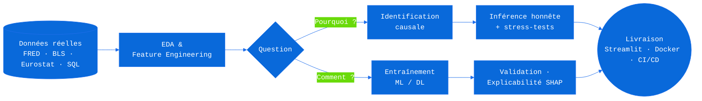
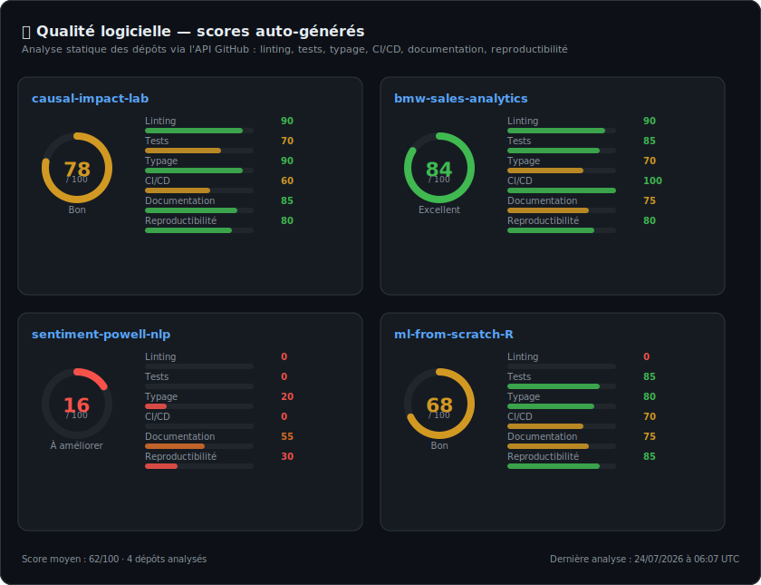

  

  

    

  
  
  

 

## Qui je suis

Je suis data scientist chez Aubay et diplômé d'un MSc en économétrie et statistiques. Ce qui m'intéresse, c'est de comprendre pourquoi un résultat est vrai : dérivation d'une identification causale, simulation de DGP, interrogation des hypothèses avant de livrer en production.

Sur ce profil, j'ai préféré indiquer des niveaux honnêtes plutôt que d'écrire « expert » partout, et j'ai ajouté une section sur ce que je ne sais pas encore faire.

 

## La méthode

<table>
  <tr>
    <td width="50%" valign="top">
      <h3 align="center">Le Pourquoi, l'économétrie</h3>
      
<em>Isoler la causalité de la simple corrélation</em>

      <ul>
        <li>Identification causale : effets fixes, hétérogénéité transversale, chocs identifiés, <em>impulse responses</em></li>
        <li>Économétrie de panel, séries temporelles (ARIMA, GARCH), microéconométrie (scoring logistique)</li>
        <li>Hypothèses explicites, stress-tests d'identification, corrections de comparaisons multiples</li>
      </ul>
    </td>
    <td width="50%" valign="top">
      <h3 align="center">Le Comment, le machine learning</h3>
      
<em>Prédire juste, expliquer pourquoi, livrer en production</em>

      <ul>
        <li>Gradient boosting, deep learning tabulaire, NLP (fine-tuning BERT, embeddings + BiLSTM/CNN)</li>
        <li>IA générative : RAG, agents, LangChain/LangGraph, avec un harnais d'évaluation pour chaque système</li>
        <li>Explicabilité SHAP, décision sous incertitude, Streamlit, Docker, CI/CD</li>
      </ul>
    </td>
  </tr>
</table>

## Les trois projets qui me résument

**[causal-impact-lab](https://github.com/maxime2476/causal-impact-lab)**, le projet le plus proche de ce que j'aime faire. J'y estime l'effet causal des chocs de politique monétaire américaine sur l'emploi sectoral : identification triangulée, local projections, DiD, hétérogénéité dynamique, robustesse exhaustive (specification curves, tests de placebo, chocs synthétiques). Démo Streamlit interactive.

**[ml-from-scratch-R](https://github.com/maxime2476/ml-from-scratch-R)**, mon projet de fin d'études. Je réimplémente chaque modèle de machine learning en R base à partir de sa dérivation mathématique, avec tests par propriété et validation sur des DGP connus. C'est long, c'est utile pour comprendre ce qu'on oublie dans scikit-learn.

**[bmw-sales-analytics](https://github.com/maxime2476/bmw-sales-analytics)**, le projet le plus proche de la production. 50 000 transactions sur quinze ans, de l'économétrie et du gradient boosting pour comprendre et prédire les marges. API externe (Fixer), Docker, CI/CD, déploiement Hugging Face Spaces, SHAP pour l'explicabilité client.

Pour le reste : [sentiment-powell-nlp](https://github.com/maxime2476/sentiment-powell-nlp), du NLP sur les conférences du FOMC (2020–2025), où les clusters *dovish* précèdent les baisses de taux de deux trimestres. Et [panel-project](https://github.com/maxime2476/panel-project), ma première vraie régression de panel sur les déterminants du PIB par habitant en Europe.

  

## Contributions open-source

Je contribue régulièrement aux libs que j'utilise, en particulier quand je trouve des bugs subtils ou des inconsistances. Ici, les plus significatives :

| Projet | Type | Description | Statut |
| :--- | :--- | :--- | :---: |
| **[ultralytics#24751](https://github.com/ultralytics/ultralytics/pull/24751)** | Fix | 2D grayscale NumPy array prediction sur modèles couleur. PIL acceptait, NumPy crashait. Root cause : channel expansion manquante. | ✅ Merged |
| **[ultralytics#24750](https://github.com/ultralytics/ultralytics/issues/24750)** | Issue | Bug report + root cause analysis (LoadPilAndNumpy._single_check). Proposé fix précis avec MRE 4-liner. | 🎯 Fixed |
| **[statsmodels#9832](https://github.com/statsmodels/statsmodels/pull/9832)** | Maintenance | `scipy.interpolate.interp2d` supprimé de SciPy, TableDist devait adapter. Clean up. | ✅ Merged |
| **[statsmodels#9891](https://github.com/statsmodels/statsmodels/issues/9891)** | Issue | `describe()` crashe sur DataFrames vides (0 rows). Symptômes différents par dtype. Analysé root cause, proposé deux approches (fail fast vs graceful). | 🔍 Reviewed |
| **[aeon-toolkit#3424](https://github.com/aeon-toolkit/aeon/pull/3424)** | Bug fix | `TimeSeriesKernelKMeans` mutait le paramètre `kernel` en place. Regression test inclus. | ✅ Merged |
| **[linearmodels#697](https://github.com/bashtage/linearmodels/pull/697)** | Docs | Typos et clarifications dans docstrings. | ✅ Merged |

La plupart de mes issues sont des rapports détaillés : j'aime comprendre le *pourquoi* avant de proposer une fix, et j'essaie de rendre le diagnostic aussi clair que possible pour les mainteneurs.

## GenAI Lab, la roadmap publique

Mon prochain chantier, c'est l'IA générative, que je veux aborder comme le reste : je ne livrerai pas un système que je ne sais pas évaluer. Beaucoup de démos RAG n'ont aucun harnais d'évaluation ; je veux l'inverse.

| Projet | Objectif | Stack visée | Statut |
| :--- | :--- | :--- | :---: |
| **rag-eval-lab** | Pipeline RAG sur corpus économique (rapports FOMC, Eurostat) avec harnais d'évaluation complet : Recall@k, MRR, nDCG, *faithfulness*, taux d'hallucination, comparaison LLM vs embeddings | LangChain, Ollama, Claude/GPT, DuckDB | 🔄 En cours |
| **agent-econ-analyst** | Agent d'analyse économétrique : orchestration multi-outils (SQL, statsmodels, recherche documentaire), traçabilité complète, garde-fous testés | LangGraph, tool-use, audit trail | 📋 Planifié |
| **llm-fine-tuning** | Prolongement de `sentiment-powell-nlp` : passer du fine-tuning BERT aux LLMs (LoRA/QLoRA), comparaison honnête *prompting* vs RAG vs fine-tuning à coût égal | HuggingFace, Unsloth, Claude API | 📋 Planifié |

Les statuts seront mis à jour au fil des livraisons, métriques comprises, même si elles sont décevantes.

## Ce que je sais faire, et à quel point

  
    
  
  
  
  
  
  
  

<!-- Graphique radar dynamique : calculé chaque nuit depuis les langages,
     imports et configurations de tous mes dépôts publics.
     Généré par .github/workflows/skills-graph.yml -->

  

### Ce que je ne sais pas (encore) faire

Kubernetes et l'orchestration à grande échelle. Le deep learning au niveau recherche (je lis les papiers, je ne les écris pas). Le front-end au-delà de Streamlit. Et en GenAI, je débute : je vais comprendre ce qui marche vraiment en le construisant moi-même.

## Standards

Ce que j'essaie de mettre dans chacun de mes projets sérieux, et qui se vérifie dans les dépôts : un typage strict, des tests à plusieurs niveaux (unitaires, par propriétés, golden, DGP synthétiques), documentation exécutable (Quarto), CI/CD (GitHub Actions), gestion des dépendances (pyproject.toml, renv), reproductibilité (seeds, versioning).

<!-- Scores de qualité auto-générés : analyse statique de chaque dépôt
     (linting, tests, typage, CI/CD, documentation, reproductibilité).
     Généré par .github/workflows/quality-scores.yml -->

  

## Télémétrie

Mon temps de code réel de la semaine (WakaTime, mis à jour chaque nuit) :

<!--START_SECTION:waka-->
<!--END_SECTION:waka-->

  <!-- Stats et langages générés par GitHub Action, committés dans le repo :
       aucune dépendance à l'instance publique Vercel (peu fiable, cf. issue #1471 du projet) -->
  

    

  <picture>
    <source media="(prefers-color-scheme: dark)" srcset="https://github-readme-activity-graph.vercel.app/graph?username=maxime2476&bg_color=transparent&color=9198a1&line=58A6FF&point=58A6FF&area=true&area_color=58A6FF&hide_border=true" />
    
  </picture>

  <picture>
    <source media="(prefers-color-scheme: dark)" srcset="https://raw.githubusercontent.com/maxime2476/maxime2476/output/github-snake-dark.svg" />
    
  </picture>

  <picture>
    <source media="(prefers-color-scheme: dark)" srcset="./profile-3d-contrib/profile-night-green.svg" />
    
  </picture>

## En ce moment

Je finalise `ml-from-scratch-R` module par module, je monte `rag-eval-lab` (premiers résultats encourageants sur l'évaluation de faithfulness), et j'approfondis les stress-tests d'identification de `causal-impact-lab`. Je suis ouvert à toute proposition : embauche, collaboration, revue de code, objection sur une méthode.

Si quelque chose ici vous parle (un projet, une remarque, une proposition, ou même une objection sur un choix de méthode), écrivez-moi : [maxime.gourguechon76@gmail.com](mailto:maxime.gourguechon76@gmail.com)

Dernière mise à jour : juillet 2026. Ce profil évolue avec mes dépôts.

   

  **Mes dépôts épinglés sont juste en dessous, c'est là que tout se vérifie.**

  

