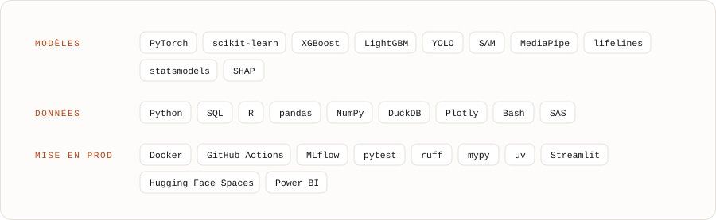

<picture>
  <source media="(prefers-color-scheme: dark)" srcset="assets/header-dark.svg">
  
</picture>

Je construis des modèles. Du deep learning quand la donnée est riche (images, texte),
de l'économétrie quand la question est causale et qu'une erreur d'interprétation coûte
plus cher qu'un point de F1.

## En ce moment

Stage de fin d'études chez Aubay, en vision par ordinateur, sur la segmentation d'images
de récifs coralliens. Le pipeline se fait en deux temps, YOLO pour la détection puis SAM3
pour le masque, sur 8 000 images, et il tient 92 % de précision. Le vrai travail n'a pas
été le modèle : il a été l'écart entre des photos propres et de vraies plongées. J'ai donc
passé beaucoup de temps sur les augmentations (flou, dérive colorimétrique de l'eau, avec
Albumentations) et sur l'automatisation de la préparation du dataset, ce qui a retiré six
heures par cycle d'entraînement.

À côté, je termine un M2 Économétrie et Statistiques à l'Université de Lille. Je cherche
un CDI à partir de septembre 2026, à Paris ou en remote, sur la partie modèle : data
scientist, ML engineer, AI engineer.

## Quatre projets qui disent comment je travaille

**[causal-impact-lab](https://github.com/maxime2476/causal-impact-lab)** &nbsp;·&nbsp; l'effet
causal d'un choc de politique monétaire restrictive sur l'emploi américain. La question, le
signe attendu et les conditions de falsification ont été figés avant la première estimation.
Quatre estimateurs plus tard (projection locale sur panel avec interaction, LP-DiD, double
machine learning, LP hiérarchique bayésienne), sur un panel QCEW étendu à 1994-2020 et
descendu au NAICS 3 chiffres, la réponse est un nul propre : le signe attendu sur les 25
horizons, des leads d'event study sans pré-tendance, des magnitudes petites et non
significatives. Le projet le dit comme ça, en
première page. C'est le résultat dont je suis le plus fier, et c'est celui qui n'a pas
« marché ».
 `statsmodels` · `double ML` · `inférence bayésienne` · `pytest` · `mypy --strict` · `Docker` · [démo](https://huggingface.co/spaces/maxime2476/causal-impact-lab)

<picture>
  <source media="(prefers-color-scheme: dark)" srcset="assets/irf-dark.svg">
  
</picture>

La figure est tracée depuis `app/assets/headline_irf.csv` du dépôt, sans retouche. C'est
exactement ce que la bande de confiance doit montrer quand un résultat est nul : le signe est
là, la précision ne suit pas.

**[git-survival](https://github.com/maxime2476/git-survival)** &nbsp;·&nbsp; de l'analyse de
survie appliquée aux historiques Git, pour estimer quand un contributeur décroche. Les mêmes
outils qu'en épidémiologie, sauf que le « décès » est un dernier commit, et que la censure
(le nouveau venu qui n'a simplement pas encore recommité) est traitée pour ce qu'elle est.
Kaplan-Meier pour la courbe globale, Cox pour isoler les facteurs de risque (ratio de commits
nocturnes, bus factor, sentiment des messages de commit, contagion des départs dans l'entourage
direct), un modèle AFT qui choisit sa loi parmi plusieurs. Le rapport sort en HTML autonome.
 `lifelines` · `PyDriller` · `TextBlob` · `Plotly` · `Streamlit`

**[bmw-sales-analytics](https://github.com/maxime2476/bmw-sales-analytics)** &nbsp;·&nbsp; 50 000
transactions BMW sur quinze ans, enrichies par des API macro, carburant, CO₂ et change. Le
pipeline atteint un R² validé croisé d'environ 0,85 sur de la donnée porteuse de signal, mais
ce jeu-là est structurellement propre et vide : aucune variable n'explique le prix. Plutôt que
de livrer un modèle décoratif, j'ai documenté l'absence de signal et réorienté le produit vers
un simulateur de scénarios avec intervalles de crédibilité. Le reste est de la plomberie
assumée : tests, couverture, images multi-étapes, CI, docs publiées.
 `XGBoost` · `SHAP` · `DuckDB` · `MLflow` · `Docker` · `GitHub Actions` · [démo](https://maxime2476-bmw-sales-analytics.hf.space)

Le tableau de bord en conditions réelles, de la vue exécutive au simulateur de scénarios.
Cliquer ouvre la démo en ligne.

**[heron](https://github.com/maxime2476/heron)** &nbsp;·&nbsp; « nommé d'après l'oiseau qui a une
meilleure posture que toi ». Un moniteur de posture par webcam qui tourne en local, sans rien
envoyer nulle part. Un Isolation Forest apprend ma posture de référence pendant un court
calibrage puis signale les dérives, le Face Mesh de MediaPipe compte les clignements pour la
fatigue oculaire, et la capture tourne dans un thread séparé de l'analyse pour que l'affichage
ne lague pas. Écrit d'abord parce que j'en avais besoin.
 `MediaPipe` · `OpenCV` · `scikit-learn` · `SQLite` · `Streamlit`

Il y a aussi [sentiment-powell-nlp](https://github.com/maxime2476/sentiment-powell-nlp), un
pipeline TF-IDF et K-Means sur 40 conférences de presse du FOMC, qui relie le ton hawkish ou
dovish de la Fed aux rendements boursiers à trente jours. C'est plus ancien, mais c'est là que
j'ai commencé à faire du NLP sérieusement.

## Ma façon de faire, en quatre lignes

- J'écris la question et ce qui la ferait échouer avant de lancer la première régression, sinon on finit toujours par trouver ce qu'on cherchait.
- Un résultat nul se publie comme un autre. Deux de mes projets se terminent sur un nul ou sur un dataset sans signal, et c'est écrit en haut du README, pas dans une note de bas de page.
- Un modèle qui ne tourne que dans mon notebook ne compte pas. Docker, tests, CI et suivi d'expériences font partie du travail, pas de la finition.
- Les choix d'architecture sont datés et justifiés dans des ADR, parce que dans six mois j'aurai oublié pourquoi j'ai écarté l'autre option.

## Les outils

<picture>
  <source media="(prefers-color-scheme: dark)" srcset="assets/stack-dark.svg">
  
</picture>

Ce que j'utilise vraiment, pas la liste de tout ce que j'ai croisé une fois.

## Ce que je ne sais pas encore

Je n'ai pas déployé sur une infra cloud de production : mes modèles vivent en Docker et sur
Hugging Face Spaces. Je prépare la certification AWS Machine Learning Engineer Associate pour
combler ça, en visant le déploiement et le monitoring plutôt que le trivia de service. Côté
LLM et agents, je lis et je bricole, mais je n'ai pas encore mis un système à base d'agents
en production. Autant le dire ici plutôt qu'en entretien.

## Le reste

Master 1 Finance et ingénierie financière à l'IAE Saint-Étienne avant Lille, licence d'économie
à Rouen. Mémoire de M1 sur la correction de biais non gaussiens par bootstrap, panel de 15 pays
sur 55 ans, DEA et régression de Simar-Wilson. Certification Data Analyst (DataCamp), Voltaire niveau
professionnel. Anglais B2. En dehors : les marchés, les cryptos, et des parties d'échecs
autour de 1200 ELO.

## Me joindre

[LinkedIn](https://www.linkedin.com/in/maximegourguechon/) · [maximeg2408@gmail.com](mailto:maximeg2408@gmail.com)

Les illustrations de cette page sont des SVG animés écrits pour ce profil, pas des badges
générés : la courbe du haut est une vraie courbe de survie (bande de confiance, marques de
censure, médiane), et la fonction de réponse plus haut est tracée depuis les résultats réels de
<a href="https://github.com/maxime2476/causal-impact-lab">causal-impact-lab</a>. Le GIF est un
enregistrement du tableau de bord, pas une maquette.
