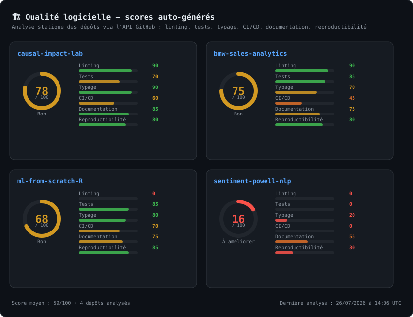

  

  

    

  
  
  

 

## Qui je suis

Data scientist chez Aubay, diplômé d'un MSc en économétrie et statistiques. Ce qui m'intéresse, c'est de comprendre pourquoi un résultat est vrai : dérivation de l'identification, simulation du DGP, interrogation des hypothèses avant de livrer.

En pratique, ça donne des projets dont le résultat n'est pas toujours celui que j'espérais. Mon dépôt principal publie un **effet nul**, sur une hypothèse que j'avais figée avant d'estimer et que je n'ai pas retouchée ensuite.

 

## Contributions open-source

Je contribue aux bibliothèques que j'utilise, surtout quand je tombe sur un bug subtil. C'est la partie de mon profil que vous pouvez vérifier sans me croire sur parole.

| Projet | Type | Description | Statut |
| :--- | :--- | :--- | :---: |
| [ultralytics#24751](https://github.com/ultralytics/ultralytics/pull/24751) | Fix | Prédiction sur array NumPy 2D en niveaux de gris, modèle couleur. PIL acceptait, NumPy crashait. Cause racine : expansion de canaux manquante. | Mergée |
| [statsmodels#9832](https://github.com/statsmodels/statsmodels/pull/9832) | Maintenance | `scipy.interpolate.interp2d` retiré de SciPy, `TableDist` devait s'adapter. | Mergée |
| [aeon-toolkit#3424](https://github.com/aeon-toolkit/aeon/pull/3424) | Bug fix | `TimeSeriesKernelKMeans` mutait le paramètre `kernel` en place. Test de non-régression inclus. | Mergée |
| [linearmodels#697](https://github.com/bashtage/linearmodels/pull/697) | Docs | Coquilles et clarifications dans les docstrings. | Mergée |
| [ultralytics#24750](https://github.com/ultralytics/ultralytics/issues/24750) | Issue | Rapport et analyse de cause racine (`LoadPilAndNumpy._single_check`), correctif proposé avec un MRE de 4 lignes. | Corrigée |
| [statsmodels#9891](https://github.com/statsmodels/statsmodels/issues/9891) | Issue | `describe()` plante sur un DataFrame vide, avec des symptômes différents selon le dtype. Deux approches proposées : échec explicite ou dégradation propre. | En revue |

## Les projets

### [causal-impact-lab](https://github.com/maxime2476/causal-impact-lab) · [démo](https://huggingface.co/spaces/maxime2476/causal-impact-lab)

L'effet causal des chocs de politique monétaire américaine sur l'emploi. J'ai figé la question, le signe attendu, les horizons de décision et les conditions de falsification avant d'estimer, et je ne les ai pas révisés ensuite.

Résultat : sur l'échantillon disponible, la réponse relative de l'emploi à l'exposition aux taux n'est pas significative aux horizons de décision. β̂(h=12) = +0.19, du mauvais signe, p ajustée BH-FDR ≈ 0.996. Quatre estimateurs concordent (projection locale de panel interagie, LP-DiD, double ML, LP hiérarchique bayésienne), la specification curve et les tests placebo aussi. Je signale moi-même la pré-tendance marginale en h = −2 qui fragilise l'hypothèse de tendances parallèles, et la contrainte principale : l'API QCEW limite le panel à 2014-2020, avec de la variation d'exposition sur 11 supersecteurs seulement.

Le complément agrégé va dans le sens attendu (θ ≈ −6.6 % à h = 12) mais repose sur un instrument externe faible, donc je le rapporte à part et il ne sauve pas le résultat principal.

### [ml-from-scratch-R](https://github.com/maxime2476/ml-from-scratch-R)

Mon projet de fin d'études. Seize modules, de l'algèbre linéaire à SHAP, chacun réimplémenté en R base à partir de sa dérivation mathématique complète. Chaque module livre quatre choses dans cet ordre : la dérivation, le code, la validation contre le package de référence à une tolérance de `1e-8`, et une étude Monte Carlo d'au moins mille réplications sur un DGP connu qui mesure biais, variance et couverture.

C'est long. C'est utile pour comprendre ce qu'on oublie dans scikit-learn.

### [bmw-sales-analytics](https://github.com/maxime2476/bmw-sales-analytics) · [démo](https://maxime2476-bmw-sales-analytics.hf.space)

50 000 transactions sur quinze ans, et un jeu de données qui s'est révélé structurellement sans signal. Plutôt que de forcer un modèle, je l'ai démontré : corrélation maximale de 0.009 entre variables, élasticité-prix de −0.001 (p = 0.92), test de permutation à p ≈ 0.90, AUC de 0.51 une fois la fuite de données retirée, contre 1.00 en la laissant, ce qui est la signature d'une fuite. Le deep learning tabulaire n'y bat pas non plus la moyenne.

Pour montrer que le pipeline fonctionne malgré tout, la même chaîne atteint une R² validée croisée de 0.85 sur une cible porteuse de signal, avec SHAP qui retrouve les vrais déterminants. La valeur métier passe ensuite par un simulateur de scénarios explicitement étiqueté comme tel. Docker, CI/CD, API externes, déploiement Hugging Face.

### Et aussi

[linux-sys-monitor](https://github.com/maxime2476/linux-sys-monitor), un daemon Bash de supervision qui ne dépend de rien d'autre que des utilitaires Unix standard : métriques matérielles, intégrité de fichiers en SHA-256, expiration des certificats SSL, auto-réparation systemd, alertes Discord/Slack. Image publiée sur GHCR, CI ShellCheck.

[sentiment-powell-nlp](https://github.com/maxime2476/sentiment-powell-nlp), 40 conférences de presse du FOMC entre 2020 et 2025, une segmentation *hawkish* / *dovish* par SVD et k-means, et la corrélation des tonalités avec le S&P 500, le NASDAQ et le Bitcoin de J à J+30.

[panel-project](https://github.com/maxime2476/panel-project), ma première vraie régression de panel sous Stata : les déterminants du PIB par habitant en Europe, POLS, effets fixes, aléatoires et différences premières.

  

## Ce que je sais faire

  

Côté économétrie : identification causale par les chocs, panel, séries temporelles (ARIMA, GARCH), microéconométrie. Côté ML : gradient boosting, deep learning tabulaire, NLP (fine-tuning BERT, embeddings et BiLSTM/CNN), explicabilité SHAP, décision sous incertitude. Et l'outillage autour : Stata, Quarto, DuckDB, Streamlit, Docker, CI/CD.

### Ce que je ne sais pas (encore) faire

Kubernetes et l'orchestration à grande échelle. Le deep learning au niveau recherche : je lis les papiers, je ne les écris pas. Le front-end au-delà de Streamlit. Et en IA générative, je débute, ce qui est l'objet du chantier ci-dessous.

## GenAI Lab, la roadmap publique

Je ne livrerai pas un système que je ne sais pas évaluer. Beaucoup de démos RAG n'ont aucun harnais d'évaluation, et c'est ce que je veux construire en premier. Ces trois projets **n'existent pas encore** : les dépôts s'ouvriront quand il y aura quelque chose à lire dedans, métriques comprises, même décevantes.

| Projet | Objectif | Stack visée |
| :--- | :--- | :--- |
| `rag-eval-lab` | Pipeline RAG sur corpus économique (FOMC, Eurostat) avec harnais complet : Recall@k, MRR, nDCG, *faithfulness*, taux d'hallucination | LangChain, Ollama, Claude/GPT, DuckDB |
| `agent-econ-analyst` | Agent d'analyse économétrique : orchestration multi-outils (SQL, statsmodels, recherche documentaire), traçabilité, garde-fous testés | LangGraph, tool-use, audit trail |
| `llm-fine-tuning` | Prolongement de `sentiment-powell-nlp` : du fine-tuning BERT aux LLM (LoRA/QLoRA), comparaison *prompting* contre RAG contre fine-tuning à coût égal | HuggingFace, Unsloth, Claude API |

## Standards

Typage strict, tests à plusieurs niveaux (unitaires, par propriétés, golden, DGP synthétiques), documentation exécutable en Quarto, CI/CD, dépendances verrouillées, seeds et versioning.

Le graphique ci-dessous note mes dépôts sur ces six axes. Il est calculé par [mon propre script](.github/scripts/generate_quality_scores.py), donc lisez-le pour ce qu'il est : une analyse statique, pas un audit indépendant, et une grille qui ne sait juger que du Python et du R. Je le laisse tel quel, y compris le score bas de `sentiment-powell-nlp`. C'est un projet académique que je n'ai jamais remis aux standards du reste, et le cacher m'intéresse moins que de dire pourquoi.

  

  

## Le calendrier des commits

Sous les cases habituelles, deux panneaux : la moyenne par jour de la semaine, et l'autocorrélogramme de la série quotidienne avec ses bandes à 95 %.

Je mets le retard 7 en évidence qu'il ressorte ou non, parce que c'est l'hypothèse que je pose d'avance, celle d'un rythme hebdomadaire. Le pied de page rappelle qu'en testant 21 retards au seuil de 5 %, on en attend un qui franchit la bande par pur hasard, ce qui interdit de lire le plus haut pic comme une trouvaille.

  

## Me contacter

Je suis en écoute pour un poste de data scientist en CDI, et toujours partant pour une collaboration open-source ou une revue de code.

Si quelque chose ici vous parle (un projet, une remarque, ou une objection sur un choix de méthode), écrivez-moi : [maxime.gourguechon76@gmail.com](mailto:maxime.gourguechon76@gmail.com)

Dernière mise à jour : juillet 2026. Les dépôts épinglés sont juste en dessous, c'est là que tout se vérifie.
