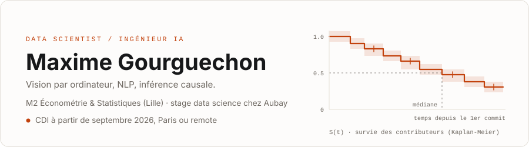
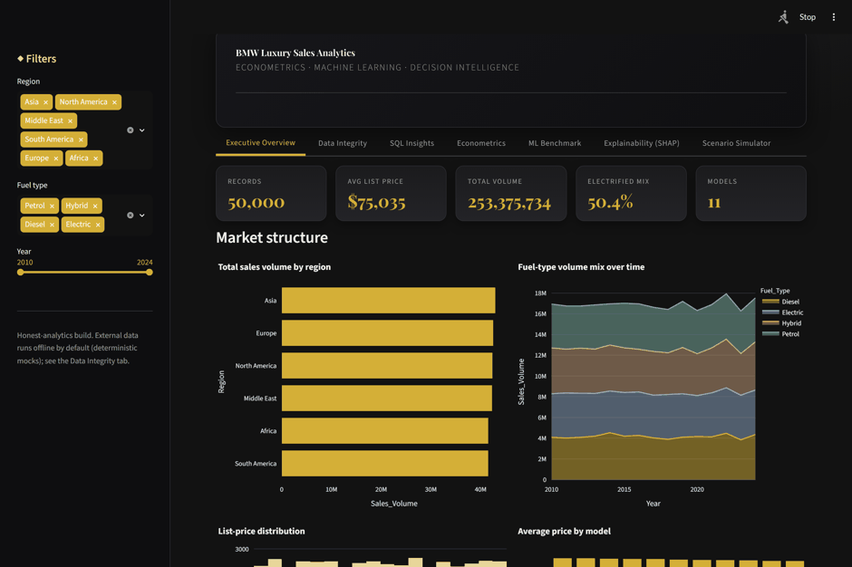

<picture>
  <source media="(prefers-color-scheme: dark)" srcset="assets/header-dark.svg">
  
</picture>

Salut, moi c'est Maxime. Je suis en master d'économétrie à Lille et en stage de fin d'études chez
Aubay, en vision par ordinateur. Je cherche un premier poste en data science ou en IA pour
septembre 2026, du côté de ceux qui construisent les modèles.

Je viens de l'économie, pas de l'informatique. J'y ai appris à me méfier des corrélations et à
vérifier qu'un résultat tient debout avant d'y croire. Le code, je l'ai appris sur mes projets,
et ils sont tous ici.

## Ce que je fais en ce moment

Chez Aubay, je travaille sur la segmentation d'images de récifs coralliens : retrouver chaque
corail sur une photo et détourer son contour au pixel près, sur environ 8 000 images.

Ça marche en deux temps. Un premier modèle repère les coraux, un second découpe leur contour.
Le faire fonctionner sur des photos propres n'a pas été le plus dur. Le vrai problème est arrivé
avec les images de plongée réelles : c'est flou, ça bouge, et l'eau avale le rouge, donc tout
vire au bleu-vert. J'ai fabriqué ces défauts à la main pendant l'entraînement, pour que le modèle
les rencontre avant de les subir. Il tient 92 % de précision.

<picture>
  <source media="(prefers-color-scheme: dark)" srcset="assets/pipeline-dark.svg">
  
</picture>

J'ai aussi automatisé la préparation des données avant chaque entraînement. Ça n'a rien de
spectaculaire et ça fait gagner six heures par cycle, donc deux fois plus d'essais dans la
semaine.

## Mes projets

Quatre projets, avec à chaque fois la question de départ et ce que j'en ai tiré.

### causal-impact-lab

**Est-ce que remonter les taux d'intérêt détruit vraiment des emplois ?**

J'ai écrit la question, et ce qui me ferait répondre non, avant de lancer le moindre calcul.
Ensuite j'ai mesuré, sur l'emploi américain, État par État et secteur par secteur, de 1994 à
2020. L'effet va dans le sens attendu partout, mais il reste trop imprécis pour qu'on puisse
affirmer qu'il existe.

J'aurais pu ranger ce résultat dans un tiroir et montrer autre chose. Il est en première page du
dépôt, avec sa raison : la période disponible est trop courte pour trancher.

<picture>
  <source media="(prefers-color-scheme: dark)" srcset="assets/irf-dark.svg">
  
</picture>

Comment la lire : la ligne orange est l'effet estimé, mois après mois, et la zone claire
autour est la marge d'erreur. Tant que cette zone contient zéro, on ne peut pas affirmer que
l'effet existe. C'est le cas ici, et c'est la conclusion.

Le détail technique

- Quatre estimateurs se répondent : projection locale sur panel avec interaction, LP-DiD, double machine learning, projection locale hiérarchique bayésienne. Aucun ne conclut, ce qui est en soi une information.
- Les données couvrent 1994 à 2020, au niveau État par secteur à trois chiffres NAICS, soit environ 4 500 cellules. Les chocs viennent de la série Bu-Rogers-Wu, le taux directeur du taux fantôme de Wu-Xia.
- L'écart-type est calculé de quatre façons différentes, parce que le choix naïf le divisait par trois et rendait tout significatif. C'est documenté dans une décision datée du dépôt.
- Les contrôles automatiques du dépôt refusent une modification qui casse les tests, le typage strict ou le style.

`statsmodels` · `double machine learning` · `pytest` · `Docker` · [l'appli en ligne](https://huggingface.co/spaces/maxime2476/causal-impact-lab)

### git-survival

**Quand est-ce qu'un développeur arrête de contribuer à un projet ?**

J'ai repris les outils de l'analyse de survie, ceux qui servent en médecine à estimer le temps
avant une rechute, et je les ai appliqués aux historiques Git. Le contributeur remplace le
patient, l'abandon du projet remplace la rechute.

Toute la difficulté tient dans un détail : quelqu'un qui n'a rien poussé depuis trois semaines
n'est pas forcément parti. Une moyenne ne sait pas quoi faire de ce cas, ces méthodes-là si.
L'outil sort un rapport HTML avec les courbes et la liste des contributeurs les plus près de
décrocher.

Le détail technique

- Un contributeur est considéré comme parti après 90 jours sans commit. Sinon sa ligne est marquée comme incomplète et compte quand même, c'est tout l'intérêt de la méthode.
- Trois modèles : Kaplan-Meier pour la courbe d'ensemble, Cox pour isoler les facteurs de risque, et un modèle à temps accéléré qui choisit lui-même sa loi entre plusieurs candidates.
- Les facteurs testés sont la part de commits nocturnes et de week-end, le fait d'être seul à toucher ses fichiers, le ton des messages de commit, et le départ des collaborateurs proches.
- Les identités sont fusionnées avant l'analyse : une même personne avec deux adresses e-mail créerait un faux abandon. Mon propre historique a le problème.

`lifelines` · `PyDriller` · `Plotly` · `Streamlit`

### bmw-sales-analytics

**50 000 ventes de voitures, un jeu de données impeccable, et rien à prédire.**

Aucune valeur manquante, aucun doublon, quinze ans d'historique. Et aucune colonne n'explique
quoi que ce soit. Le réflexe habituel serait de changer d'algorithme jusqu'à ce qu'un chiffre
présentable finisse par sortir.

J'ai fait l'inverse : j'ai prouvé que le problème venait des données et pas de moi. Le même
programme, lancé sur des données témoins où le signal existe, obtient un R² de 0,85 ; sur les
vraies données, il tombe à zéro. À la place du modèle, j'ai livré un simulateur : on y manipule
des hypothèses explicites au lieu de recevoir une prédiction sans fondement.

Le détail technique

- Le test décisif est celui de permutation : on mélange les étiquettes au hasard et on compare. Le modèle entraîné sur les vraies données ne fait pas mieux que sur les fausses (p = 0,90).
- Trois autres tests confirment : le prix et le kilométrage se comportent comme des tirages uniformes, et aucune paire de colonnes catégorielles n'est liée aux autres.
- Une colonne prédisait la cible parfaitement, parce qu'elle en était une transformation directe. Repérée et écartée avant modélisation.
- Le reste est de la plomberie assumée : 67 % de couverture de tests, image Docker multi-étapes, suivi d'expériences avec MLflow, documentation publiée automatiquement.

`XGBoost` · `SHAP` · `DuckDB` · `Docker` · [l'appli en ligne](https://maxime2476-bmw-sales-analytics.hf.space)

### heron

**Un moniteur de posture, écrit parce que je passais mes journées avachi devant l'écran.**

La webcam regarde comment je me tiens. Un modèle apprend ma posture correcte pendant un court
calibrage, puis me prévient quand je m'en éloigne. Il compte aussi mes clignements pour repérer
la fatigue des yeux. Tout reste sur ma machine, rien ne part ailleurs.

Le nom vient de l'oiseau, qui a une meilleure posture que moi.

Le détail technique

- La posture de référence est apprise par un Isolation Forest pendant le calibrage, ce qui évite de coder des seuils d'angle à la main et tient quand je tourne la tête.
- La fatigue oculaire vient du rapport d'ouverture des yeux, calculé sur le maillage facial de MediaPipe, qui donne un taux de clignements par minute.
- La capture vidéo et l'analyse tournent dans deux fils d'exécution séparés, sinon l'affichage saccade dès que l'analyse ralentit.
- L'historique est stocké en SQLite et consultable dans un tableau de bord. Les alertes passent par les notifications natives de Windows.

`MediaPipe` · `OpenCV` · `scikit-learn` · `SQLite`

Il y a aussi [sentiment-powell-nlp](https://github.com/maxime2476/sentiment-powell-nlp), mon
premier vrai projet de NLP : j'y analyse le ton des conférences de presse de la Fed et je le
compare aux marchés un mois plus tard.

## Pour vérifier par vous-même

Je préfère qu'on ouvre le capot plutôt qu'on me croie sur parole.

- **En 3 minutes**, les deux applications tournent en ligne, il n'y a rien à installer : [le simulateur BMW](https://maxime2476-bmw-sales-analytics.hf.space) et [causal-impact-lab](https://huggingface.co/spaces/maxime2476/causal-impact-lab).
- **En 20 minutes**, [les résultats de causal-impact-lab](https://github.com/maxime2476/causal-impact-lab/blob/main/docs/results.md) donnent le verdict et ses limites, dans cet ordre.
- **En 1 heure**, clonez le dépôt et lancez `uv sync --all-extras` puis `uv run pytest`. Ce sont les contrôles qui tournent tout seuls à chaque modification.

## Trois notes

Un modèle se défend autant à l'écrit qu'au tableau. Trois textes courts, sur des choses que j'ai
vraiment eu à trancher.

- [Ce que la censure change quand on mesure un abandon](notes/01-censure-et-abandon.md) : pourquoi compter tous les inactifs récents comme des partants fabrique une fausse épidémie de départs.
- [Un dataset peut être impeccable et ne rien contenir](notes/02-un-dataset-propre-et-vide.md) : comment prouver l'absence de signal au lieu de la soupçonner.
- [Ce qui casse quand on segmente sous l'eau](notes/03-segmenter-sous-l-eau.md) : l'eau absorbe le rouge, et faire pivoter les images ne protège de rien.

## Comment je travaille

- J'écris la question et ce qui la ferait échouer avant de lancer le premier calcul, sinon on finit toujours par trouver ce qu'on cherchait.
- Quand un résultat ne conclut pas, je le publie quand même. Deux de mes projets se terminent comme ça, et c'est écrit en haut de leur page.
- Un modèle qui ne tourne que dans mon notebook ne compte pas : les tests, Docker et les vérifications automatiques font partie du travail.
- Je note pourquoi j'ai écarté une option, parce que dans six mois je l'aurai oublié.

## Ce que je sais faire, et ce que je ne sais pas encore

<picture>
  <source media="(prefers-color-scheme: dark)" srcset="assets/methods-dark.svg">
  
</picture>

Une barre de compétence à 90 % ne veut rien dire, alors j'ai rangé les choses en trois niveaux
que je peux défendre en entretien. La troisième colonne est courte et elle est honnête : ce sont
les sujets dont je sais parler mais que je n'ai pas encore mis en production. J'y travaille, en
commençant par la certification AWS Machine Learning Engineer.

## En dehors du code

Master 1 de finance à l'IAE Saint-Étienne avant Lille, licence d'économie à Rouen. Mémoire de M1
sur la correction d'un biais statistique, appliqué à quinze pays sur cinquante-cinq ans.
Certification Data Analyst chez DataCamp, Voltaire niveau professionnel, anglais B2. Le reste du
temps : les marchés, un peu de crypto, et des parties d'échecs autour de 1200 ELO.

## Me joindre

[LinkedIn](https://www.linkedin.com/in/maximegourguechon/) ·
[maximeg2408@gmail.com](mailto:maximeg2408@gmail.com) ·
[CV en PDF](https://github.com/maxime2476/cv/releases/latest/download/CV_Maxime_Gourguechon.pdf)

Le CV est recompilé automatiquement depuis <a href="https://github.com/maxime2476/cv">son
source LaTeX</a> à chaque modification, donc ce lien est toujours à jour. Les images de cette page
sont des SVG faits pour ce profil : celle du haut est une vraie courbe de survie, celle de
causal-impact-lab est tracée depuis les résultats du dépôt, et tout se régénère avec
<code>python tools/render_assets.py</code>.
